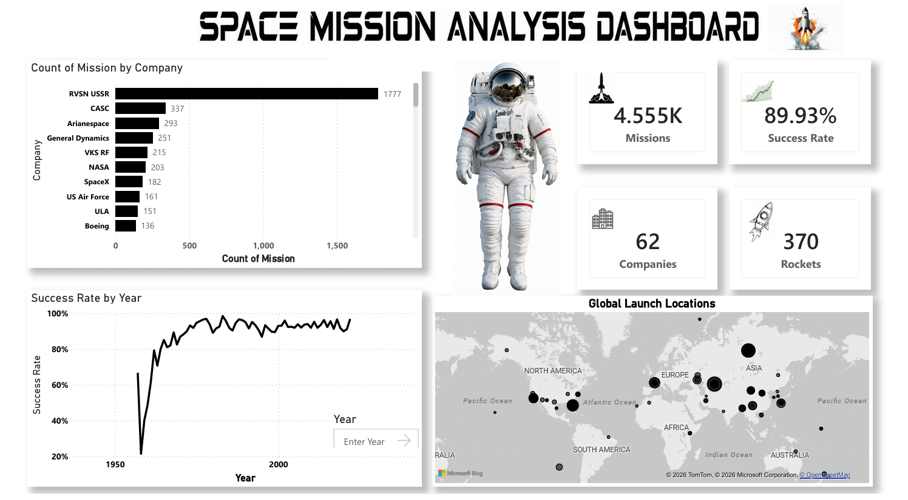

# 🚀 Space Mission Analysis Dashboard

## 📌 Project Overview

This project presents an interactive Power BI dashboard that analyzes historical space mission data from various organizations and countries worldwide. The dashboard provides insights into mission performance, launch trends, company contributions, success rates, and global launch locations.

The goal of this project is to transform raw space mission data into meaningful visualizations that help understand the evolution and success of space exploration activities.

---

## 🎯 Objectives

* Analyze historical space mission records.
* Track mission success rates over time.
* Identify leading space organizations by mission count.
* Visualize global launch locations.
* Explore trends in space exploration activities.
* Generate data-driven insights from mission data.

---

## 🛠️ Tools & Technologies

* Power BI
* Data Cleaning
* Data Transformation
* Data Visualization
* DAX
* Business Intelligence

---

## 📊 Dashboard Highlights

### Key Performance Indicators (KPIs)

* Total Missions: **4,555**
* Success Rate: **89.93%**
* Total Companies: **62**
* Total Rockets: **370**

### Visualizations Included

* Mission Count by Company
* Success Rate by Year
* Global Launch Locations Map
* KPI Cards for Mission Statistics
* Interactive Filtering and Exploration

---

## 🔍 Key Insights

* The Soviet space program (RVSN USSR) conducted the highest number of recorded missions.
* Mission success rates have improved significantly over the decades.
* Space missions are concentrated in specific launch regions across the globe.
* A small number of organizations account for a large share of total launches.
* The modern era shows consistently high mission success rates compared to early space exploration years.

---

## 📈 Skills Demonstrated

* Data Analysis
* Data Cleaning
* Data Modeling
* DAX Calculations
* KPI Development
* Dashboard Design
* Geographic Analysis
* Business Intelligence
* Storytelling with Data

---

## 🚀 Learning Outcomes

Through this project, I gained hands-on experience in analyzing large historical datasets, creating interactive dashboards, designing KPIs, building geographic visualizations, and communicating insights effectively through Power BI.

---

## 📷 Dashboard Preview

---

## 📂 Dataset Features

* Mission Name
* Company
* Rocket Type
* Mission Status
* Launch Date
* Launch Location
* Country
* Mission Outcome

---

## 📝 Conclusion

This project demonstrates how Power BI can be used to analyze complex historical datasets and transform them into meaningful business intelligence solutions. The dashboard provides a clear understanding of global space exploration trends, mission success patterns, and organizational contributions to the space industry.

---

Aspiring Data Analyst | SQL | Python | Power BI | Tableau | Data Visualization | Business Intelligence
